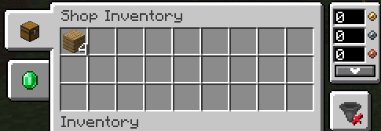

# Base Cost
The cost of a base (copper per banner) doubles each week. For example, your starting base starts with 16 banners in week one, so 400 copper (4 silver) needs to be in the raid chest at all times.

| Week | Copper per Banner |
| -- | -- |
| 1 | 50 |
| 2 | 100 |
| 3 | 200 |
| 4 | 400 |

# Designing a Base

1. Anyone can build a base by placing their team’s banners at ground level around an area.
2. There must be 2 banners facing outward at each corner and 1 banner every 10 blocks.
3. The base borders must be rectangular.
4. The base must have a tower at least 8 blocks high near the center of the base with a banner on each side of the tower, all visible outside of the base.
5. The base must have a raid chest, with a sign above it reading `Raid Chest`, at the bottom of the base’s center tower that is theoretically reachable without destroying any blocks.
7. Once built, the base must be registered under your team's color by verbally informing the moderator.
8. The moderator will give you a base number and you can then fill out the required base sign:

Base X

Owners: Regulator,

Phabbits

# Declaring a Raid

2. To declare a raid, first select which base (in this case base 5) by typing:
    - `/trigger raid-base set 5`
3. Then activate the raid against the team owning the base (in this case team blue):
    - `/trigger raid-blue`

# Declaring a War

2. To declare a war (in this case against team blue), type:
    - `/trigger war-blue`

# Declaring a Truce

2. To request a truce type:
    - `/trigger truce`

One player from every team must request a truce in order for it to start. Any war or raid called during this process will reset all previous truce requests.

# Working
The [JobsAddon](/emmm/jobs-addon/) mod rewards the player for performing simple "jobs" like cutting down trees or farming. It is important you select a job by going to your inventory and clicking on the jobs tab at the top of the inventory. Here you can select a task you would like to be rewarded for. Lumberjack, Builder, and Warrior are all good starting jobs.

When you level up your job, you will get experience points towards skills (described in [LevelZ](/emmm/levelz/) and money. You can change your job every 20 minutes, but specializing in one job will give you the best rewards.

# Trading
The [Numismatic Overhaul](https://docs.wispforest.io/numismatic-overhaul/home/) mod allows players to place trading tables and set up villager-like trades. This means players can deposit some item (say a diamond) and request some amount of money (say a silver coin) for said item. The seller would fill the trading table with as many items as they'd like to sell and collect money from it after someone has purchased the items.

Players can set up trade tables in the neutral base marked by white banners in the middle of the map. This area is protected from griefing and looting.

Trading is important since the [LevelZ](/emmm/levelz/) mod forces players to specialize in a skill to obtain high-level items.

# Setup a Shop
Shops allow you to trade with other players even when you are not there. You simply craft a shop block and then stock it with items and it will trade like a villager for you.

## Craft a Shop Block
A shop can be crafted early on:

To set a trade for other players click on the place shop and then on the emerald tab. Place the resource you want to sell in the box to the right, and enter the amount.

Don't forget to keep the inventory stocked so that other players can continue to trade with you.

Other players will be able to see your trades and trade their currency for your goods.

## Move Currency
To move currency from your inventory to your purse, you must equip it and then right click.

# Mods

The selected mods enhance trading, combat, and the general sense of adventure.

Trading is made necessary because players cannot harvest everything they need due to skill limitations. Users can place down shops which allow other players to trade with them even when they are not there.

Combat has new moves you can do, new weapons, an added backslot to your character, and you now keep all of your weapons and armor when you die.

## Core Mods
- [LevelZ](/emmm/levelz/) - Adds skills to unlock abilities
- [JobsAddon](/emmm/jobs-addon/) - Adds jobs to earn money

## Supporting Mods
- [AdventureZ](https://globoxwiki.com/mods/adventurez/) - Adds mobs
- [Another Furniture](https://www.curseforge.com/minecraft/mc-mods/another-furniture) - Adds furniture
- [Backslot](https://globoxwiki.com/mods/backslot/) - Adds ability to store tools on your back
- [Better Combat](https://github.com/ZsoltMolnarrr/BetterCombat) - Greatly enhances combat
- [Campanion](https://www.curseforge.com/minecraft/mc-mods/campanion) - Many camping related additions including a backpack
- [EMI](https://www.curseforge.com/minecraft/mc-mods/emi) - Recipes
- [Keep Some Inventory](https://shaders-pre-product.modrinth.com/mod/keep-some-inventory) - Allows you to keep armor and weapons when dying
- [Medival Weapons](https://globoxwiki.com/) - New weapons
- [Numismatic Overhaul](https://docs.wispforest.io/numismatic-overhaul/home/) - Added currency (1 gold = 100 silver, 1 silver = 100 bronze)
- [Spiders 2.0](https://www.curseforge.com/minecraft/mc-mods/spiders-2-0) - Made spiders more scary
- [Transportables](https://www.curseforge.com/minecraft/mc-mods/grims-transportables) - Adds carts for transportation
