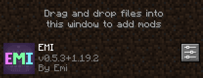

# Frequently Asked Questions

## What is the server address?
`frey.network`

## Who are the moderators?
`Phabits`
`Regulators`

## Can I get an invite to the Discord server?
[Discord](https://discord.gg/7UWZUXtz)

## How do I join a team?
`/trigger join-<color>`

## How to hide the EMI overlay?
EMI shows all the different block on the right over your inventory, and can get in the way. To hide it:

1. Go to Game Menu | Mods | EMI
2. Select the three scroll bars representing mod options on the right.
3. Set Enabled to false.

   

## Moderators
### How do I update a base's value?
`scoreboard players set <base> Raid_Chest <score>`

### How do I update a base's team?
`team join <color> <base>`

Use `neutral` for no team color.
