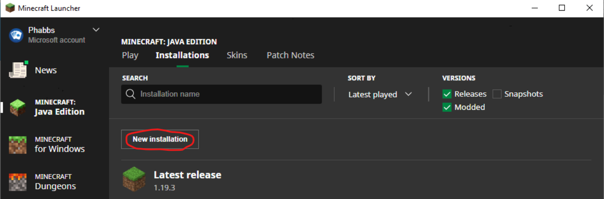

# How to Play
To play Eric's Mine Mod Madness, you need the Phame Launcher appropriate for your operating system:

[Install for Windows](#install-for-windows)

[Install for MacOS](#install-for-macos)

[Run from Phame Launcher](#run-from-phame-launcher)

[Install Minecraft 1.19.2](#install-minecraft-1192)

# Install for Windows
1. Click Download for Windows [here](https://phame.dev).
2. Click _See more_.

3. Click _Open file_.

4. Click _Yes_.

5. In the Phame Launcher installer click _I Agree | Next | Install | Next | Finish_.

6. [Run from Phame Launcher](#run-from-phame-launcher)

# Install for MacOS
1. Click Download for MacOS [here](https://phame.dev).
2. Accept downloads from phame.dev and open the download.
3. Drag the Phame - Launcher into your Applications.

4. Control-click the Phame - Launcher and select _Open_.

5. Select _Open_.

6. [Run from Phame Launcher](#run-from-phame-launcher)

# Run from Phame Launcher
6. In the Phame Launcher click _Commands_.

7. For Eric's Mine Mod Madness click _Run_.

8. The resulting script will take you through the rest of the installation process.

# Install Minecraft 1.19.2
1. In the Minecraft Launcher ensure you have _Java Edition_ selected and then select _Installations_.

2. Select _New installation_.

3. In the _Versin_ dropdown, select _release 1.19.2_.

4. Select _Play_ by the new installation.

