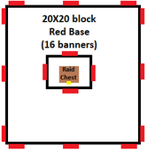
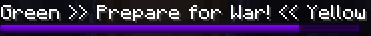

# Introduction
What follows is a game of raiding, trading, upgrading, and of course, [demarcating](https://dictionary.cambridge.org/dictionary/english/demarcating). Players will join their team members in seeking a balance between collegial commerce and Roman rule in a quest to build the largest and wealthiest empire they can. Peace is a fragile thing in Phame Games’© Minecraft® Eric's Mine Mod Madness™!

# Object of the Game
Be the team to control the most money (represented by gold, silver, and bronze coins) at the end of the play period (4 weeks). Money is obtained through working, trading, and raiding.

# Rules
There are a few simple, but very important rules to keep the game enjoyable for the creators and – uh, de-creators of the game alike.
## Definitions
| Term | Definition |
| -- | -- |
| Base | An above ground area surrounded by colored banners with a tower in the center that has banners on each side. A base includes all airspace and 6 blocks below the surface. |
| Raid | An attack by one team on a single base of another team. |
| War | A mutual attack between all bases of two teams. |
| Raid Chest | A chest at the bottom of the base’s tower that holds money that can be stolen during a raid or war. Amount depends on the base’s size. |
| Loot | To steal from a chest (other than the raid chest during a raid/war) |
| Grief | To destroy buildings or structures (besides small, infiltration damage during a raid/war) |

## Main Rules
1. No griefing or looting within the boundaries of someone else’s base, ever.
2. No emptying the raid chest or attacking players in their base, unless that base is being raided or that team is at war with your team.
3. Griefing, looting, and attacking are all permissible at any time outside of established bases. You may always attack other players in your base.
## Base Rules

1. Anyone can build a base by placing their team’s banners at ground level around an area.
2. There must be 2 banners facing outward at each corner and 1 banner every 10 blocks.
3. The base borders must be rectangular.
4. The base must have a tower at least 8 blocks high near the center of the base with a banner on each side of the tower, all visible outside of the base.
5. The base must have a raid chest with a sign above it reading `Raid Chest` at the bottom of the base’s center tower that is theoretically reachable without destroying any blocks.
6. The base must have a main entrance with the base number and the owners. For example:
    
Base 6

    
Owners: Regulator,

    
Phabbits

7. Once built, the base must be registered under your team color by verbally informing the moderator of the base number and team color

## Raid Rules
1. At least half of the base’s owners must be online to start a raid at that base.
2. Anyone can declare a raid on another team’s base as long as there is no raid timer present for that base (including pre- and post-raid) and that team is not involved in a war.
2. To declare a raid, first select which base (in this case base 5) by typing:
    - `/trigger raid-base set 5`
3. Then activate the raid against the team owning the base (in this case team blue):
    - `/trigger raid-blue`
4. Once the raid is declared, the defending team will be warned and the dark gray pre-raid timer is started. Only the defending team is allowed in the base during the pre-raid.
5. The raid is marked by a timer of the defending team’s color. The attackers will try to reach and empty the raid chest. This is the only time the raid chest can be looted.
6. After the raid, successful or not, a white post-raid timer will commence. The base cannot be raided again during this time and the defenders have this long to refill the raid chest.
8. No player will respawn during a raid.

## War Rules

1. At least half of each team’s players must be online to start a war.
2. To declare a war (in this case against team blue), type:
    - `/trigger war-blue`
3. Wars are the same as raids, except every base of both teams are being raided at once.
4. Only the two teams at war can freely empty raid chests.
5. The post-war timer prevents both wars and raids for a set time against that team.

## Capture Rules
1. If a base has no raid or war timer running, its raid chest must be adequately filled.
2. If it is not, any player at that base can inform the moderator to change the base to the neutral color, eliminating the base’s grief and loot protections.
3. A neutral base can be captured by being first to fill its raid chest adequately and infroming the moderator.

# Brief Mod Overview
This competition will be played with several mods to facilitate a robust gameplay experience. All mods are downloadable automatically using the [Phame Games launcher](https://phame.dev).

## Core Mods
- [LevelZ](https://www.curseforge.com/minecraft/mc-mods/levelz)
- [JobsAddon](https://www.curseforge.com/minecraft/mc-mods/jobsaddon)

## Supporting Mods
- [AdventureZ](https://globoxwiki.com/mods/adventurez/)
- [Another Furniture](https://www.curseforge.com/minecraft/mc-mods/another-furniture)
- [Backslot](https://globoxwiki.com/mods/backslot/)
- [Better Combat](https://github.com/ZsoltMolnarrr/BetterCombat)
- [Campanion](https://www.curseforge.com/minecraft/mc-mods/campanion)
- [EMI](https://www.curseforge.com/minecraft/mc-mods/emi)
- [Keep Some Inventory](https://shaders-pre-product.modrinth.com/mod/keep-some-inventory)
- [Medival Weapons](https://globoxwiki.com/)
- [Numismatic Overhaul](https://docs.wispforest.io/numismatic-overhaul/home/)
- [Spiders 2.0](https://www.curseforge.com/minecraft/mc-mods/spiders-2-0)
- [Transportables](https://www.curseforge.com/minecraft/mc-mods/grims-transportables)
