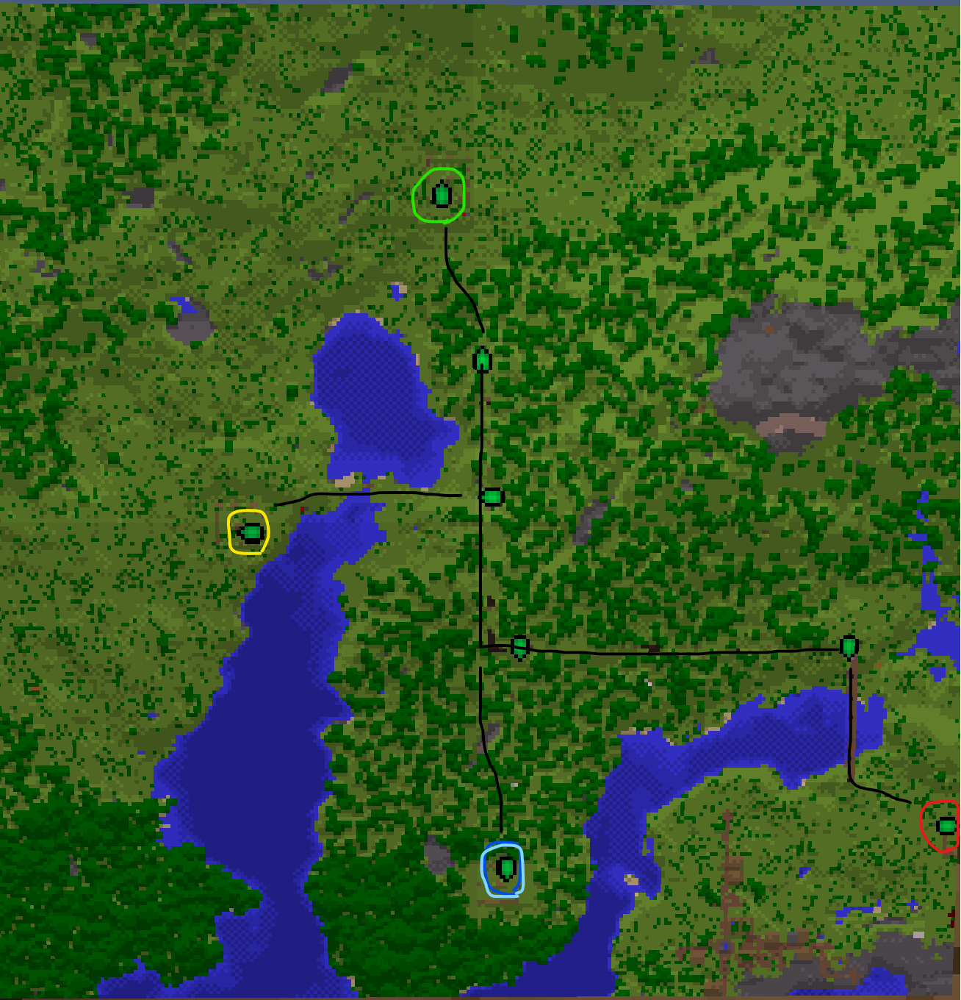

# Introduction
What follows is a game of raiding, trading, upgrading, and of course, [demarcating](https://www.wordnik.com/words/demarcate). Players will join their team members in seeking a balance between collegial commerce and Roman rule in a quest to build the largest and wealthiest empire they can. Peace is a fragile thing in Phame Games’© Eric's Mine Mod Madness™!

# Object of the Game
The goal is to be the team to control the most money (represented by gold, silver, and bronze coins) at the end of the play period (4 weeks). Money is obtained through working, trading, and raiding.

**The mods included purposefully restrict what you can do to encourage specializing in one job and relying on others for what else you need.** [Learn More](/emmm/details/#mods)

# Rules
There are a few simple, but very important rules to keep the game enjoyable for the creators and – uh, de-creators of the game alike.

## Definitions
| Term | Definition |
| -- | -- |
| Base | A specific area designated by the team's color banners and made official by a moderator, numbered 1 through 15. A base includes all enclosed airspace and **6 blocks below** the surface. It must feature a tower in the center with identifying banners. |
| Raid | An attack by one team on a single base of another team. |
| War | A mutual attack between all bases of two teams. |
| Raid Chest | A chest at the bottom of the base’s tower which **must be filled** with the base's cost in money which can be stolen during a raid or war. [Amount depends on the base’s size](/emmm/details/#base-cost). |
| Loot | To steal from a chest or shop (other than the raid chest during a raid/war). |
| Grief | To destroy buildings or structures (besides small, infiltration damage during a raid/war). |

## Main Rules
1. No griefing or looting within the boundaries of someone else’s official base, ever (or the neutral base in the middle).
2. No stealing from the raid chest or attacking players in their base, unless that base is being raided or that team is at war with your team.
3. Griefing, looting, and attacking are all permissible at any time outside of established bases. You may always attack other players in your base.
4. No players of ANY team may enter a base if less than half of its owners are online (i.e. no hiding in bases that cannot be raided).

## Base Rules

Bases are designed to be **significant undertakings** when the extra protections against griefing and looting are desired.

See [Designing a Base](/emmm/details/#designing-a-base) for how to create one.

## Raid Rules
1. At least half of the base’s owners must be online to start a raid at that base (Base owners are on the sign at the base entrance, press `tab` to show who's online).
2. Anyone can declare a raid on another team’s base as long as there is no raid timer present for that base (including pre- and post-raid), and that team is not involved in a war.
3. Raids have three stages:
    
    1. Pre-raid - Marked by a purple timer, the attackers must not enter the defenders base during this preparation time.
    
    2. Raid - Marked by a red timer, the attackers try to steal from the defenders raid chest.
    
    3. Post-raid - Marked by a gray timer, the attackers may no longer be in the base, and the defenders must refill the raid chest with the base's cost before this timer is up.

See [Declaring a Raid](/emmm/details/#declaring-a-raid) for how to start one.

## War Rules

1. At least half of each team’s players must be online to start a war.
3. Wars are the same as raids, except every base of both teams are being raided at once.
4. Only the two teams at war can freely steal from raid chests.
5. The post-war timer prevents both wars and raids for a set time against that team.

See [Declaring a War](/emmm/details/#declaring-a-war) for how to start one.

## Truce Rules

1. All teams must request a truce for it to start.
2. No raids or wars may occur during a truce.
3. After a truce, all players must double their base cost in their raid chest.

See [Declaring a Truce](/emmm/details/#declaring-a-truce) for how to start one.

## Capture Rules
1. If a base has no raid or war timer running, its raid chest must be adequately filled.
2. If it is not, any player can inform the moderator to change the base to the neutral color, eliminating the base’s grief and loot protections.
3. A neutral base can be captured by being first to fill its raid chest adequately and informing the moderator.

# Getting started
First, select a job by entering your inventory (pressing E) and going to the Jobs tab. [Select a job](/emmm/jobs-addon/#job-tasks) whose tasks you can easily perform. Lumberjack is recommended to start with. This will be your source of income to trade with other players and give you experience to upgrade skills.

Certain things including using upgraded tools and harvesting different resources **are restricted at the beginning of the game**. You must invest in different [skills to unlock](/emmm/levelz/#unlocking-abilities) these usually normal abilities.

Once you are established, [setup a shop](/emmm/details/#setup-a-shop) to begin trading and strategize diplomacy with other teams. Use `/tm ` to easily message teammates in game.

# Brief Mod Overview
This competition will be played with several mods to facilitate a robust gameplay experience. All mods are downloaded automatically using the [Phame Launcher](https://phame.dev), see [How to Play](/emmm/how-to-play). See the list of mods [here](/emmm/details/#mods).

# FAQ
Have a question? Check out this [Frequently Asked Question](/emmm/faq/) page.

# Credit
Special thanks to Eric, Isaiah, and Sammie.
